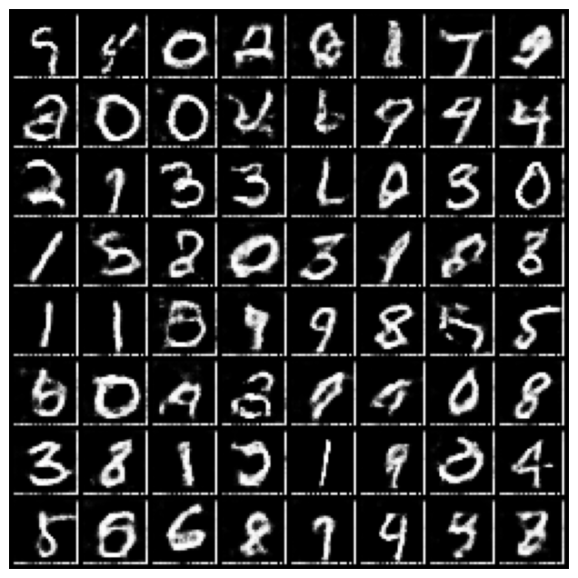
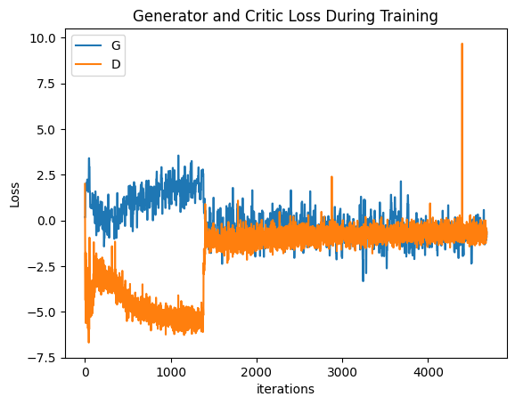

# MNIST GAN

This project implements a Generative Adversarial Network (GAN) to generate MNIST digit images.

## Generated Images

Here are some examples of images generated by the GAN:

## Training Loss

The following plot shows the training loss over time:

